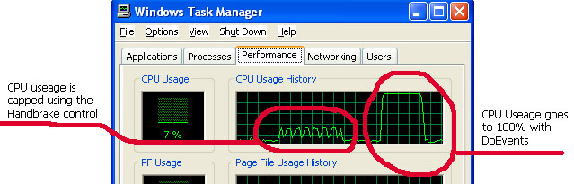



## Handbrake

### Description

The screenshot should give you a good idea of what this control does. It slows down your code. It's like a DoEvents you can manage. Great for background tasks.

I had an app that needed to do database maintenance to a very large number of records. Firing the maintence sub caused the cpu to run at 100% for several minutes during which time the user could not do anything as their system all but locked up. Hence this handbrake. Using it you can run your process in the background without causing the user any inconvenience. If you set CPULimit to 0 it will introduce a one second wait into each itteration of your loop. This will create a burst effect where your routine does a process, then waits for 1 second, then does another burst etc. Alternativly you can set CPULimit to the maximum level at which your app can process to. So you could create a situation such as... do the work, but dont exceed 10% of the cpu useage. If the user is doing something then the control will just hold your app suspended until CPU useage falls, or if the user isnt using the CPU then your app can grab it and process in the background. It is important to structure your loop properly. See sample for how to use.
 
### More Info
 

             |
---                |---
**Submitted On**   |2005-05-20 11:56:48
**By**             |[GDuncan](https://github.com/Planet-Source-Code/PSCIndex/blob/master/ByAuthor/gduncan.md)
**Level**          |Intermediate
**User Rating**    |5.0 (15 globes from 3 users)
**Compatibility**  |VB 6\.0
**Category**       |[Custom Controls/ Forms/  Menus](https://github.com/Planet-Source-Code/PSCIndex/blob/master/ByCategory/custom-controls-forms-menus__1-4.md)
**World**          |[Visual Basic](https://github.com/Planet-Source-Code/PSCIndex/blob/master/ByWorld/visual-basic.md)
**Archive File**   |[Handbrake1890345212005\.zip](https://github.com/Planet-Source-Code/gduncan-handbrake__1-60614/archive/master.zip)

